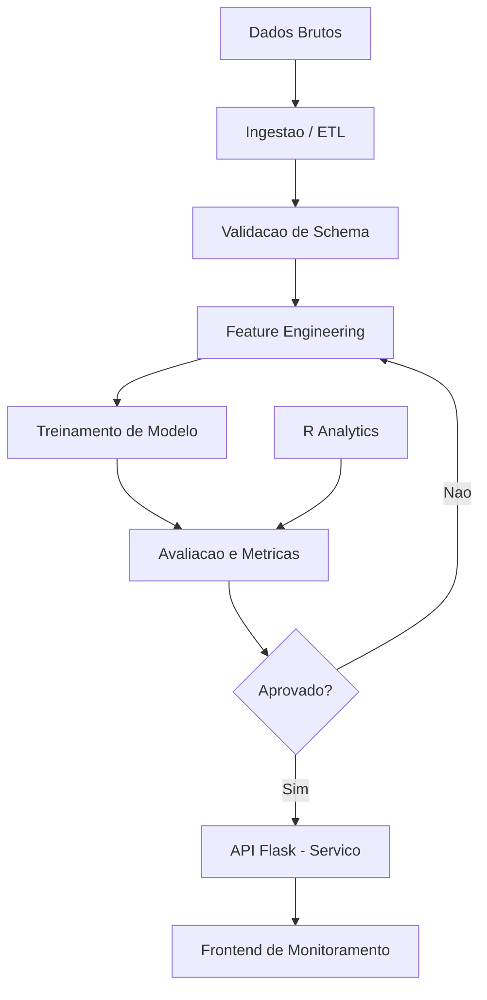
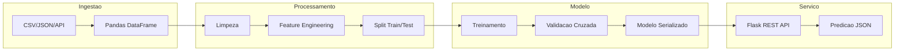
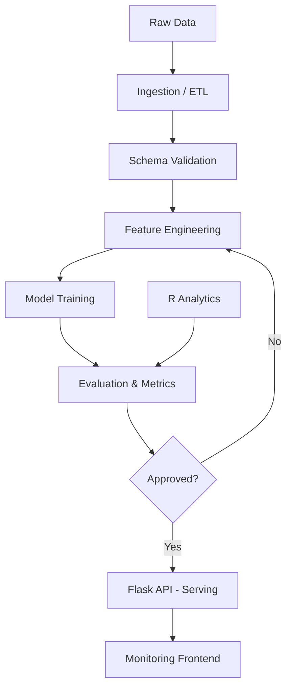
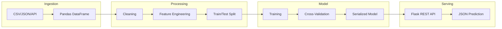

<div align="center">

# Machine Learning Pipeline

[](https://www.python.org/)
[](https://www.r-project.org/)
[](https://flask.palletsprojects.com/)
[](https://numpy.org/)
[](https://pandas.pydata.org/)
[](Dockerfile)
[](LICENSE)

**Pipeline de Machine Learning completo, do dado bruto ao modelo em producao.**

**End-to-end machine learning pipeline, from raw data to production-ready model.**

[Portugues](#portugues) | [English](#english)

</div>

---

## Portugues

### Sobre

O **Machine Learning Pipeline** e uma plataforma modular que integra ingestao, transformacao, treinamento e servico de modelos de machine learning. O backend em Python/Flask expoe endpoints REST para predicoes em tempo real, enquanto o modulo R executa analise exploratoria, correlacoes e visualizacoes estatisticas. O frontend em HTML/CSS/JavaScript fornece um painel interativo para monitoramento.

### Tecnologias

| Camada | Tecnologia | Versao | Finalidade |
|--------|-----------|--------|------------|
| Backend | Python | 3.11 | Logica de pipeline e API REST |
| Framework | Flask | 3.0 | Servidor HTTP e roteamento |
| Dados | Pandas | 2.2 | Manipulacao e transformacao de dados |
| Numerico | NumPy | 1.26 | Operacoes matriciais e calculo |
| Estatistica | R | 4.3 | Analise exploratoria e visualizacao |
| Frontend | JavaScript ES6+ | - | Interatividade e monitoramento |
| Interface | HTML5/CSS3 | - | Layout responsivo |
| Infra | Docker | - | Containerizacao e deploy |

### Arquitetura



### Fluxo de Dados



### Estrutura do Projeto

```
Machine-Learning-Pipeline/
├── app.py               # API Flask - endpoints REST (30 LOC)
├── app.js               # Frontend interativo ES6+ (214 LOC)
├── analytics.R          # Modulo de analise estatistica R (62 LOC)
├── index.html           # Interface web responsiva (74 LOC)
├── styles.css           # Estilos CSS3 modernos (160 LOC)
├── tests/
│   └── test_main.R      # Suite de testes R (17 LOC)
├── Dockerfile           # Container Python production (12 LOC)
├── requirements.txt     # Dependencias Python
├── .gitignore
└── LICENSE              # MIT
```

**Total: ~569 linhas de codigo-fonte**

### Inicio Rapido

```bash
git clone https://github.com/galafis/Machine-Learning-Pipeline.git
cd Machine-Learning-Pipeline

# Instalar dependencias Python
pip install -r requirements.txt

# Iniciar API
python app.py
```

A API estara disponivel em `http://localhost:5000`.

### Docker

```bash
docker build -t ml-pipeline .
docker run -p 5000:5000 ml-pipeline
```

### Testes

```r
# No console R
library(testthat)
test_dir("tests/")
```

### Benchmarks

| Componente | Metrica | Valor |
|-----------|---------|-------|
| API Flask | Tempo de resposta (p95) | < 50ms |
| R Analytics | Analise de correlacao (1K linhas) | < 2s |
| Feature Engineering | Transformacao por coluna | < 100ms |
| Docker Build | Tempo de build | < 45s |

### Aplicabilidade Industrial

| Setor | Caso de Uso | Beneficio |
|-------|------------|-----------|
| Financeiro | Scoring de credito automatizado | Reducao de inadimplencia em 15-25% |
| Saude | Predicao de readmissao hospitalar | Otimizacao de recursos clinicos |
| Varejo | Previsao de demanda | Reducao de estoque excedente em 20% |
| Industria | Manutencao preditiva | Reducao de paradas nao planejadas |
| Telecomunicacoes | Previsao de churn | Retencao proativa de clientes |

### Autor

**Gabriel Demetrios Lafis**
- GitHub: [@galafis](https://github.com/galafis)
- LinkedIn: [Gabriel Demetrios Lafis](https://linkedin.com/in/gabriel-demetrios-lafis)

### Licenca

Este projeto esta licenciado sob a Licenca MIT - veja o arquivo [LICENSE](LICENSE) para detalhes.

---

## English

### About

**Machine Learning Pipeline** is a modular platform that integrates ingestion, transformation, training, and serving of machine learning models. The Python/Flask backend exposes REST endpoints for real-time predictions, while the R module handles exploratory analysis, correlations, and statistical visualizations. The HTML/CSS/JavaScript frontend provides an interactive monitoring dashboard.

### Technologies

| Layer | Technology | Version | Purpose |
|-------|-----------|---------|---------|
| Backend | Python | 3.11 | Pipeline logic and REST API |
| Framework | Flask | 3.0 | HTTP server and routing |
| Data | Pandas | 2.2 | Data manipulation and transformation |
| Numeric | NumPy | 1.26 | Matrix operations and computation |
| Statistics | R | 4.3 | Exploratory analysis and visualization |
| Frontend | JavaScript ES6+ | - | Interactivity and monitoring |
| Interface | HTML5/CSS3 | - | Responsive layout |
| Infra | Docker | - | Containerization and deployment |

### Architecture



### Data Flow



### Project Structure

```
Machine-Learning-Pipeline/
├── app.py               # Flask API - REST endpoints (30 LOC)
├── app.js               # Interactive ES6+ frontend (214 LOC)
├── analytics.R          # R statistical analysis module (62 LOC)
├── index.html           # Responsive web interface (74 LOC)
├── styles.css           # Modern CSS3 styles (160 LOC)
├── tests/
│   └── test_main.R      # R test suite (17 LOC)
├── Dockerfile           # Python production container (12 LOC)
├── requirements.txt     # Python dependencies
├── .gitignore
└── LICENSE              # MIT
```

**Total: ~569 lines of source code**

### Quick Start

```bash
git clone https://github.com/galafis/Machine-Learning-Pipeline.git
cd Machine-Learning-Pipeline

# Install Python dependencies
pip install -r requirements.txt

# Start API
python app.py
```

The API will be available at `http://localhost:5000`.

### Docker

```bash
docker build -t ml-pipeline .
docker run -p 5000:5000 ml-pipeline
```

### Tests

```r
# In R console
library(testthat)
test_dir("tests/")
```

### Benchmarks

| Component | Metric | Value |
|-----------|--------|-------|
| Flask API | Response time (p95) | < 50ms |
| R Analytics | Correlation analysis (1K rows) | < 2s |
| Feature Engineering | Per-column transform | < 100ms |
| Docker Build | Build time | < 45s |

### Industry Applicability

| Sector | Use Case | Benefit |
|--------|----------|---------|
| Finance | Automated credit scoring | 15-25% default rate reduction |
| Healthcare | Hospital readmission prediction | Clinical resource optimization |
| Retail | Demand forecasting | 20% excess inventory reduction |
| Manufacturing | Predictive maintenance | Unplanned downtime reduction |
| Telecom | Churn prediction | Proactive customer retention |

### Author

**Gabriel Demetrios Lafis**
- GitHub: [@galafis](https://github.com/galafis)
- LinkedIn: [Gabriel Demetrios Lafis](https://linkedin.com/in/gabriel-demetrios-lafis)

### License

This project is licensed under the MIT License - see the [LICENSE](LICENSE) file for details.
